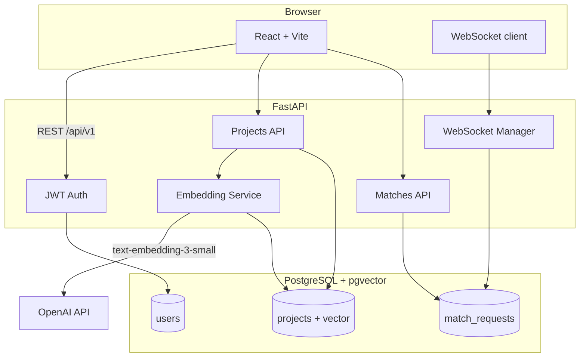

# AI DevConnect

[](https://github.com/anushkagarg-30/AiDevConnect/actions/workflows/ci.yml)

**Find collaborators for your side projects using semantic similarity — not keyword search.**

AI DevConnect is a full-stack developer networking platform. Users submit project ideas, which are embedded with OpenAI `text-embedding-3-small` and stored as 1536-dimensional vectors in PostgreSQL + pgvector. A single cosine-distance query ranks the best collaborator matches. Match requests and acceptances are delivered in real time over WebSockets.

## Live demo

| | URL |
|---|-----|
| **App** | _Deploy via Render Blueprint — see [Deploy](#deploy-to-render)_ |
| **API docs** | `https://your-api.onrender.com/docs` |

### Demo accounts (after `docker compose up` or `python scripts/seed_demo.py`)

| Email | Password | Project |
|-------|----------|---------|
| `alice@demo.com` | `demo1234` | ML Recipe Generator |
| `bob@demo.com` | `demo1234` | Smart Cooking Assistant |
| `carol@demo.com` | `demo1234` | DevOps Metrics Dashboard |

**Try it:** Log in as Alice → Projects → **Find matches** on her project → Bob's cooking assistant should rank highly → **Connect** → log in as Bob (incognito) to see the real-time notification.

## Screenshots

Add screenshots to `docs/screenshots/` before publishing (dashboard, match results, toast notification):

```
docs/screenshots/dashboard.png
docs/screenshots/matches.png
docs/screenshots/notifications.png
```

## Features

- **Semantic matching** — pgvector cosine similarity with ivfflat index (`p95 < 200ms` under 50 concurrent users, verified in CI)
- **JWT auth** — register, login, role-based access control
- **Match workflow** — send, accept, or decline collaboration requests
- **Real-time notifications** — WebSocket toasts for match events
- **React UI** — TypeScript, Tailwind CSS, responsive layout
- **CI/CD** — GitHub Actions: lint, integration tests, frontend build, Locust load test

## Architecture



### The matching query

```sql
SELECT *, 1 - (embedding <=> $1) AS similarity
FROM projects
WHERE user_id != $2
ORDER BY embedding <=> $1
LIMIT 10;
```

## Tech stack

| Layer | Technologies |
|-------|-------------|
| Backend | FastAPI, SQLAlchemy, Alembic, JWT |
| Database | PostgreSQL 16, pgvector, ivfflat index |
| Embeddings | OpenAI `text-embedding-3-small` (1536 dims) |
| Frontend | React 19, TypeScript, Tailwind CSS, Vite |
| Real-time | FastAPI WebSockets |
| Infra | Docker Compose, GitHub Actions, Render |

## Quick start

```bash
git clone https://github.com/anushkagarg-30/AiDevConnect.git
cd AiDevConnect
cp .env.example .env
docker compose up --build
```

| Service | URL |
|---------|-----|
| Frontend | http://localhost:5173 |
| API docs | http://localhost:8000/docs |
| Health | http://localhost:8000/health |

Demo users are seeded automatically on startup.

## Embedding modes

| Mode | When | Matching quality |
|------|------|------------------|
| **Mock** | `MOCK_EMBEDDINGS=true` (local default) | Deterministic hashes — good for UI/API testing |
| **OpenAI** | `MOCK_EMBEDDINGS=false` + `OPENAI_API_KEY` | Real semantic similarity (required for production) |

Check `/health` — response includes `"embedding_mode": "mock"` or `"openai"`.

## Environment variables

| Variable | Description |
|----------|-------------|
| `ENVIRONMENT` | `development`, `test`, or `production` |
| `DATABASE_URL` | PostgreSQL URL (`postgresql+asyncpg://...`) |
| `SECRET_KEY` | JWT secret (min 32 chars in production) |
| `CORS_ORIGINS` | Comma-separated allowed origins |
| `OPENAI_API_KEY` | Required when `MOCK_EMBEDDINGS=false` |
| `MOCK_EMBEDDINGS` | `true` skips OpenAI (local dev) |
| `VITE_API_URL` | Frontend API base URL (production builds) |

See `.env.example` and `frontend/.env.example` for full list.

## Load testing

```bash
./scripts/run_load_test.sh
```

Seeds 500 projects, runs 50 concurrent users for 30s, asserts **p95 < 200ms** on the matching endpoint. Use the printed p95 in your resume bullet.

## Deploy to Render

1. Push to GitHub
2. [Render Dashboard](https://dashboard.render.com/) → **New Blueprint** → connect repo
3. Set `OPENAI_API_KEY` on the API service (production uses real embeddings)
4. Migrations run automatically on deploy (including `CREATE EXTENSION vector`)

`render.yaml` provisions API (Docker), static frontend, and Postgres. `DATABASE_URL` and `CORS_ORIGINS` are wired automatically.

## Project structure

```
AiDevConnect/
├── backend/           # FastAPI API, Alembic migrations, tests
├── frontend/          # React + Tailwind UI
├── loadtests/         # Locust load test
├── scripts/           # run_load_test.sh
├── docs/              # Architecture notes, screenshots
├── render.yaml        # Render Blueprint
└── .github/workflows/ # CI pipeline
```

## Development

See [docs/DEVELOPMENT.md](docs/DEVELOPMENT.md) for local setup without Docker, API testing via Swagger, and contributor notes.

## License

[MIT](LICENSE)
